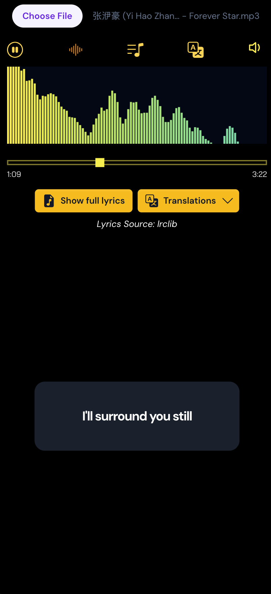

# Lyrics viewer

Simple web-based application in Vite React to view lyrics in floating mode.

**Preview**

With floating lyrics:


With full lyrics on the side:


Mobile view:



## What can lyrics viewer do?

- Load songs from your local library
- Load lyrics for the song - floating mode and full lyrics view (side by side)
- View translations for the song provided by Genius library
- Play/pause song
- Toggle equalizer
- Volume up/down

_Note: No content saved while building this application._

## Dependencies

- [Lrclib](https://lrclib.net/)
- [Lyrics.ovh](https://lyrics.ovh/)
- [Genius](https://genius.com/)

### Libraries used

- [Vite v7.0.0+](https://vitejs.dev/) as platform serving both client and server
- [React v19.2.0+](https://reactjs.org/) as frontend framework
- [Typescript v5.9.3](https://www.typescriptlang.org/) as frontend and backend language
- [Node](https://nodejs.org/en) as backend server language
- [TailwindCSS](https://tailwindcss.com/) as frontend CSS framework
- [Bai Jamjuree font](https://fontsource.org/fonts/bai-jamjuree) as styling font
- [Dm Sans font](https://fontsource.org/fonts/dm-sans) as styling font
- [Bootstrap Icons](https://icons.getbootstrap.com/) as styling icons
- [Headless UI React](https://headlessui.com/react) as styling framework
- [Motion](https://motion.dev/) as animation framework

## Install

```
npm install
```

## Build

For development, run the following commands:

```sh
# for client
npm run dev
# for server
npm run server
```

For linting, run:

```sh
npm run lint
npm run lint:fix
```

### Production Build

For production, run

```sh
npm run build # for client
npm run server:build # for server
```

For preview mode, run
```sh
npm run preview
```
